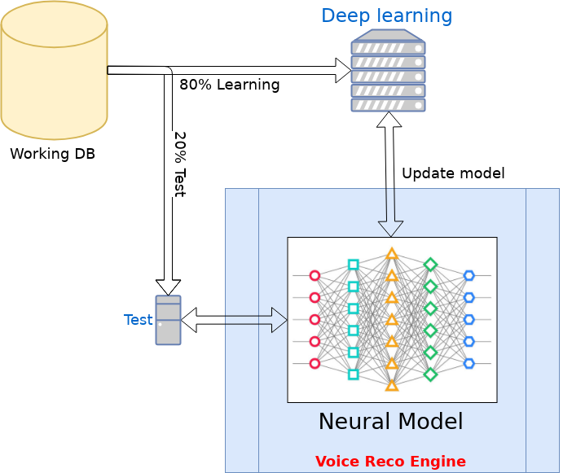

Buffoon
=======

The basis idea of this project is not set a deep leaning, this is cool...
But we want to look at the next step by using non common way to create a
new methode to "computer thinking".

We need to start dy a simple way, then we will start with audio IO then
here we will base the system of audio recognition (not speech only) and some basic control.

Ideas of architeture:
=====================

The basis data source is caming from some sources:

The objective is to use the system remotely with a personal server (communication with REST API):

Global organisation (WIP)

Basic Deep learning:

Final library objective:
========================

AI with some capabilities:
	- learn new word
	- write simple program in interpreted language
	- translate sentence
	- play music, video on other application
	- 
	
	

Some usefull library:
=====================

Voice Activity Detection (VAD): https://github.com/jtkim-kaist/VAD
Audio Denoise: https://github.com/jtkim-kaist/Speech-enhancement
Natural Language Processing (NLP): https://github.com/zalandoresearch/flair
The DBLP Computer Science Bibliography: https://datahub.io/collections/yago

License (MPL v2.0)
=====================
Copyright ejson Edouard DUPIN

Licensed under the Mozilla Public License, Version 2.0 (the "License");
you may not use this file except in compliance with the License.
You may obtain a copy of the License at

    https://www.mozilla.org/MPL/2.0

Unless required by applicable law or agreed to in writing, software
distributed under the License is distributed on an "AS IS" BASIS,
WITHOUT WARRANTIES OR CONDITIONS OF ANY KIND, either express or implied.
See the License for the specific language governing permissions and
limitations under the License.

